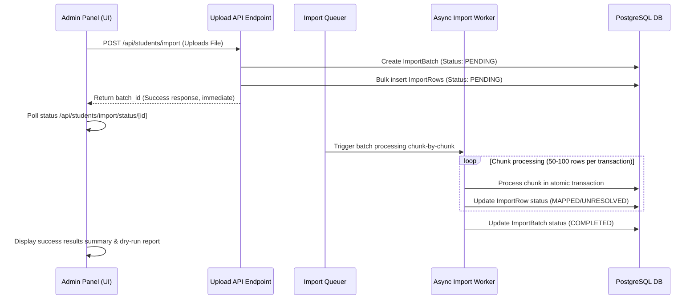

# Database API & UI Impact Design

This document details the impact of Phase 3 database additions on the system APIs and Admin User Interface, focusing on the mapping dashboard and bulk import flows.

---

## Phase 3 Additive Boundary

> [!IMPORTANT]
> **Boundary Rule**: Phase 3 is strictly **ADDITIVE**. It adds *only* the new academic registry and enrollment structures. It **MUST NOT** rename, replace, delete, or modify any existing fields, tables, or database relations.

---

## 1. Dry-Run Mapping Report UI Design

Administrators require a clean dashboard to map existing students into the new Phase 3 academic registry without guessing.

### Mapping Report Screen Specs (Elite UI/UX style):
- **Summary Banner**: Displays high-level validation statistics:
  - Total Students Count: `416`
  - Mapped Count: `385`
  - Unresolved Count: `31`
  - Validation Check status: `PASSED` (Verifies: `mapped count + unresolved count = total student count`)
- **Interactive Mapping Table**:
  - Columns:
    1. **Student ID** (UUID badge, e.g. `f8fd...3e62`)
    2. **Masked Roll Number** (e.g. `24AG****Z2`)
    3. **Existing Academic Info** (Shows combined: `CSE / A / 3rd Year`)
    4. **Proposed Mapping Info** (Shows proposed: `2023-2027 Cohort / CSE Dept / Section A`)
    5. **Mapping Status** (Colored status pill)
    6. **Action / Safety Reason** (Manual dropdown or mapping override trigger)

### Status Color Palette & Legend:
- `EXACT_MATCH` (Sleek Emerald): Matched raw values perfectly.
- `NORMALIZED_MATCH` (Mint Green): Matched after converting case/removing spaces.
- `AMBIGUOUS` (Amber / Yellow): Student has conflicting section or branch.
- `MISSING_DATA` (Slate Gray): Roll number or crucial year is empty.
- `INVALID_DATA` (Red / Crimson): CGPA out of bounds or year is invalid.
- `REQUIRES_REVIEW` (Orange): Valid institutional format but needs confirmation.

---

## 2. Asynchronous Bulk Import Engine (4,000+ Row Scale)

Currently, uploading 4,000+ rows causes HTTP timeouts. We replace the single synchronous HTTP upload with an asynchronous, chunked queuing system:

### Configurable Chunk Sizing:
- **Default Chunk Size**: `50–100` rows per transaction.
- **Why**: Keeps database transactions short, preventing lock escalation and connection pool exhaustion.
- **Configuration**: Managed via `config.json` setting `IMPORT_CHUNK_SIZE = 50` so that administrators can fine-tune size during peak loads.
- **Unresolved Rows**: Any row with missing/invalid data is flagged as `UNRESOLVED` and does not block the creation of valid rows. Unresolved students remain without a `StudentEnrollment` until an Admin manually fixes the record.
