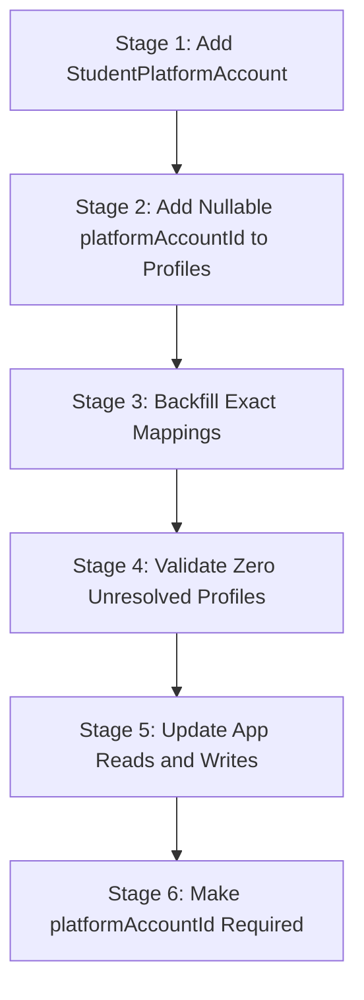

# Database Backward Compatibility Plan

This document outlines the coexistence of legacy fields with the new Phase 3 registry, and documents the platform account migration plan.

---

## Phase 3 Additive Boundary

> [!IMPORTANT]
> **Boundary Rule**: Phase 3 is strictly **ADDITIVE**. It adds *only* the new academic registry and enrollment structures. It **MUST NOT** rename, replace, delete, or modify any existing fields, tables, or database relations.

---

## 1. Coexistence of Academic Fields

To ensure existing administrative dashboards, student profiles, public leaderboards, and import endpoints continue to function without downtime:

- **Dual-Field Coexistence**: The existing columns on `student_profiles` (`department`, `year`, `branch`, `section`) are left completely intact.
- **Data Write Pipeline**:
  - Legacy APIs will write to both `student_profiles` legacy fields and `student_enrollments` tables.
  - If a student lacks a valid mapping (resulting in an unresolved status), their legacy columns will still be written to preserve existing functionality, but they will not receive a `student_enrollments` row until resolved.
- **Data Read Pipeline**:
  - Existing dashboard stats and leaderboard scripts will read from the legacy columns on `student_profiles` first.
  - A feature flag (`FLAGS_USE_ACADEMIC_REGISTRY`) will be used to switch reads to the new `student_enrollments` table once 100% of the students are verified.

---

## 2. Platform Profile Migration Stages

To transition `CodeforcesProfile`, `CodechefProfile`, `LeetcodeProfile`, and `GithubProfile` to a unified table structure without data loss or downtime, the migration must follow a 6-stage transition plan:



### Stage Details:

#### Stage 1: Add `StudentPlatformAccount`
Create the new `StudentPlatformAccount` table to act as the single source of truth for platform handles.
- Contains: `id`, `studentId`, `platform` (Enum), `handle`, `verified`, `createdAt`, `updatedAt`

#### Stage 2: Add Nullable Foreign Key
Add a nullable `platformAccountId` column to the existing tables (`codechef_profiles`, `leetcode_profiles`, `github_profiles`).
- Do **NOT** delete or drop the existing `studentId` columns or foreign keys during this initial transition.

#### Stage 3: Backfill Mappings
Execute a script to create a `StudentPlatformAccount` row for each existing profile, and populate the `platformAccountId` foreign key inside the existing profile tables.

#### Stage 4: Validate Mappings
Run an automated dry-run validation report:
```
Total existing profiles count = Mapped profiles count (where platformAccountId IS NOT NULL)
```
Ensure there are **zero** unresolved platform profiles before moving to the next stage.

#### Stage 5: Update Application Code
Update application code to write to both tables (dual-write) and read platform account details from `StudentPlatformAccount`.

#### Stage 6: Enforce Strict Relations
In a later approved migration, drop the legacy `studentId` column from the profile tables and make `platformAccountId` `NOT NULL`.

---

## 3. Platform Verification Independence

Verification status for each platform must be derived from that platform's own verification records, rather than relying on the student's global profile state:

- The existing `StudentProfile.profileStatus` (e.g. `INCOMPLETE`, `VERIFIED`, `INVALID`) represents global administrative approval.
- Platform-specific synchronization checks must verify each handle independently:
  - `CodechefProfile.verificationMetadata` and `LeetcodeProfile.verificationMetadata` store the individual verification status.
  - A student is eligible for the leaderboard if **both** platform profiles are individually verified and valid, even if the admin hasn't fully completed the student's global profile verification status.
