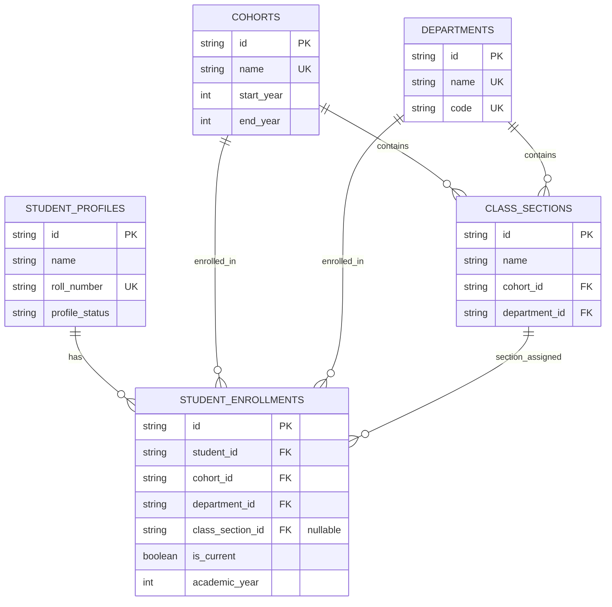

# Database Entity Relationships

This document outlines the entity-relationship diagram and detailed relationships for the database design.

---

## Phase 3 Additive Boundary

> [!IMPORTANT]
> **Boundary Rule**: Phase 3 is strictly **ADDITIVE**. It adds *only* the new academic registry and enrollment structures. It **MUST NOT** rename, replace, delete, or modify any existing fields, tables, or database relations.

---

## 1. Entity-Relationship Diagram (ERD)

The following Mermaid diagram illustrates the relationships between the newly added Phase 3 models and the existing `student_profiles` model:

---

## 2. Structural Relationships

### Cohort to ClassSection (1:N)
- A `Cohort` represents a distinct academic batch (e.g. "2023-2027").
- A `Cohort` contains multiple `ClassSection` divisions.
- **Cascading Policy**: If a `Cohort` is deleted, its related `ClassSections` are deleted (`onDelete: Cascade`).

### Department to ClassSection (1:N)
- A `Department` (e.g. "CSE") is mapped to multiple sections.
- **Cascading Policy**: If a `Department` is deleted, its related `ClassSections` are deleted (`onDelete: Cascade`).

### ClassSection Composite Integrity (Option B)
- To ensure a section is not mapped to the wrong cohort or department:
  - `ClassSection` has a unique composite key: `@@unique([id, cohortId, departmentId])`.
  - `StudentEnrollment` references this key: `classSection ClassSection? @relation(fields: [classSectionId, cohortId, departmentId], references: [id, cohortId, departmentId], onDelete: Restrict)`.
- If a section's definition is changed or removed, the action is blocked (`onDelete: Restrict`) if students are enrolled.

### StudentProfile to StudentEnrollment (1:N)
- A student has one current enrollment record (`isCurrent = true`), but may have multiple past historical enrollment records.
- **Cascading Policy**: If a `StudentProfile` is deleted, all related `StudentEnrollments` are deleted (`onDelete: Cascade`).
