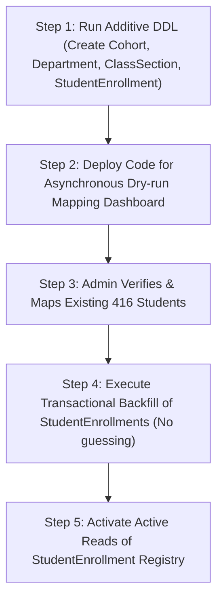

# Database Migration Strategy

This document details the deployment sequence, migration strategy, and recovery procedures.

---

## Phase 3 Additive Boundary

> [!IMPORTANT]
> **Boundary Rule**: Phase 3 is strictly **ADDITIVE**. It adds *only* the new academic registry and enrollment structures. It **MUST NOT** rename, replace, delete, or modify any existing fields, tables, or database relations.

---

## 1. Production Deployment Sequence

Deploying Phase 3 modifications without downtime requires executing operations in isolated, verified phases:



### Steps:
1. **Apply Additive Schema Migration**: Run the Prisma migration script. This creates new tables and indexes without touching existing tables.
2. **Deploy Codebase Updates**: Deploy code changes supporting the dry-run mapping report and import batch models.
3. **Seed Static Academic Constants**: Seed the `departments` and `cohorts` values (verified from official college registrar documents).
4. **Dry-Run Roll-number Normalization**: Analyze the existing 416 student profiles using the mapping utility.
5. **Backfill & Enforce**: Administrators run the bulk enrollment mapper to map students into `student_enrollments`.

---

## 2. Production Recovery & Safe Rollback Guidelines

In the event of an unexpected runtime failure or data discrepancy post-migration, the rollback procedures must follow **strict non-destructive guidelines**.

> [!WARNING]
> ### NEVER RUN IN PRODUCTION
> Under **no circumstances** may any of the following destructive commands be run on a production database:
> - `DROP TABLE`
> - `DROP COLUMN`
> - `TRUNCATE`
> - `DELETE FROM ...` (for entire tables)
> - `CASCADE` cleanups
> 
> *These destructive commands may only be documented and used within local disposable development environments.*

### Safe Production Recovery Sequence:

1. **Stop Condition (Halt Active Operations)**: Immediately pause any active CSV uploads or import batch processors in the application panel.
2. **Disable New Reads**: Update application feature flags to direct reads away from the new `student_enrollments` tables.
3. **Return Application to Legacy Reads**: Restore database reads to the legacy fields on `student_profiles` (`department`, `year`, `section`) which remain completely intact.
4. **Pause Dual Writes**: Disable writes to the new enrollment tables. Since the schema change is strictly additive, existing application write pipelines continue working without database-level blocks.
5. **Perform a Forward-Fix Migration**:
   - Analyze the bugs or performance issues.
   - Author a new forward-fix migration script that adjusts constraints or structures safely.
   - Test the forward-fix locally first, then apply it in production.
6. **Emergency Backup Restoration**: If critical database indexes become corrupted, restore the database from the last verified daily snapshot only as an approved emergency action authorized by the lead DBA.

---

## 3. Local Disposable-Development Operations

For local development databases (such as testing changes on a local SQLite or Postgres Docker container), cleanups can be executed destructively.

```sql
-- NEVER RUN IN PRODUCTION
-- Local disposable development environment cleanup only
DROP TABLE IF EXISTS student_enrollments CASCADE;
DROP TABLE IF EXISTS class_sections CASCADE;
DROP TABLE IF EXISTS departments CASCADE;
DROP TABLE IF EXISTS cohorts CASCADE;
DROP TYPE IF EXISTS "ImportBatchStatus" CASCADE;
DROP TYPE IF EXISTS "ImportRowStatus" CASCADE;
```
